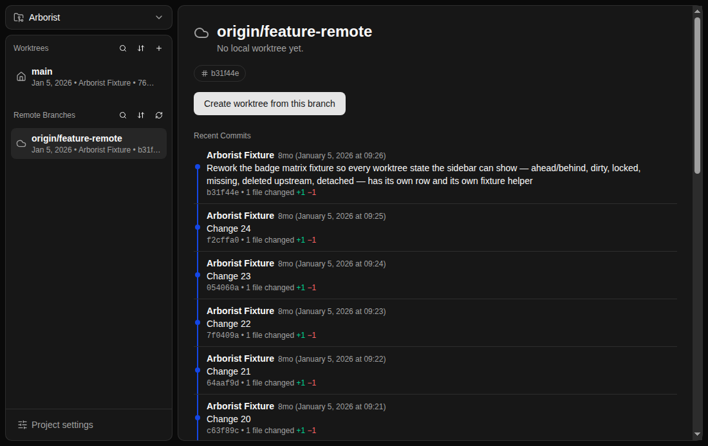

# Arborist

A git worktree manager for macOS and Windows. It lists the worktrees of the
repositories you point it at, shows what state each one is in without you
running `git status` in eight folders, creates and removes them, and opens any
of them in the terminal or editor you would have opened it in anyway.



This is v2, a ground-up rewrite of a Swift/SwiftUI original that only ran on
macOS. Electron + React + TypeScript + Tailwind v4 + shadcn/ui.

## Installing

Download the latest build from
[Releases](https://github.com/zaccomode/arborist-2/releases).

**macOS.** Take the `.dmg` matching your machine: `arm64` for Apple Silicon,
`x64` for Intel. Open it and drag Arborist to Applications. The build is signed
and notarised, so first launch shows the standard "downloaded from the internet"
prompt and nothing worse.

**Windows.** Take the `-setup.exe`. It installs per-user, so it never asks for
an administrator password. **The installer is not code-signed yet**, so
SmartScreen will interpose with "Windows protected your PC": click **More
info**, then **Run anyway**. That warning is honest, and
[docs/troubleshooting.md](docs/troubleshooting.md) explains what it means and
what is being done about it.

**Both platforms need git installed**, which is the one prerequisite. Arborist
finds it in the usual places, and tells you how to install it if it cannot.

Updates are checked on launch and every six hours after, downloaded in the
background, and applied when you say so. Arborist never restarts itself out from
under you: losing a running setup script to an update you did not agree to would
be a good reason to uninstall something.

## Why It Needs Your Git

Arborist runs the git you already have, spawned from the main process, rather
than bundling its own or linking a library. Bundling would give you a second git
with its own version, its own config, and its own credential helpers, and the
worktrees it made would be invisible to the one in your terminal. Every
operation you can see in Arborist is one you could have typed, which also means
your credential setup, your hooks, and your aliases all keep working.

The cost of that choice is a hard dependency on a git being present and
findable, and PATH on a desktop-launched app is not the PATH in your shell. The
settings screen has a manual override for when discovery gets it wrong.

## Where Your Data Goes

Nowhere. One JSON file on your machine holds the projects list, notes, presets,
and settings.

|         | Path                                                        |
| ------- | ----------------------------------------------------------- |
| macOS   | `~/Library/Application Support/Arborist/arborist-data.json` |
| Windows | `%APPDATA%\Arborist\arborist-data.json`                     |

Arborist has no account, no telemetry, and no network access of its own. The
only thing it fetches is its own update manifest from this repository's
releases.

## Why It Is Not on the Mac App Store

Arborist shells out to git and to setup scripts you write yourself, and an App
Store app cannot do either: the sandbox exists precisely to stop an app running
arbitrary executables outside its container. Direct distribution with a
Developer ID signature and notarisation is the route that keeps the feature.
That is a real trade, since it means updates come from here rather than from a
store, which is what `electron-updater` is for.

## Project Layout

```
src/
  shared/     types + pure functions only — imported by main AND renderer
  main/       Electron main process: IPC handlers, services (git, persistence, presets)
  preload/    typed, whitelisted bridge between renderer and main
  renderer/   React UI
tests/
  unit/       Vitest unit tests
  integration/  Vitest tests against real temp git repos
  e2e/        Playwright _electron smoke tests
docs/
  screenshots/  one dark and one light capture per scenario, regenerated by `npm run screenshot`
```

Import direction is enforced by ESLint: renderer never imports main/preload,
main never imports renderer, and `src/shared` stays free of Electron and Node
built-ins.

## Development

```bash
npm install
npm run dev
```

## Checks

```bash
npm run lint        # ESLint
npm run typecheck   # tsc for node + web configs
npm test            # Vitest unit and integration tests
npm run test:e2e    # builds, then runs the Playwright smoke test
npm run screenshot  # builds, then captures every UI scenario into docs/screenshots
```

CI runs the first four on macOS and Windows for every push and pull request.

## Building and Releasing

```bash
npm run build:mac   # dmg + zip, arm64 and x64
npm run build:win   # NSIS installer, x64
```

Both produce unsigned builds locally, which is fine for a look and not fine for
handing to anyone. Releases are cut by pushing a `v*` tag, which builds and
signs on CI and uploads a draft. [docs/release.md](docs/release.md) is the
runbook, including the secrets CI needs and the steps for Windows signing, which
is not set up yet.

## Further Reading

- [docs/troubleshooting.md](docs/troubleshooting.md), for the problems Arborist
  can put in front of you
- [docs/manual-checklist.md](docs/manual-checklist.md), the hand-verification
  pass before a release, since real Terminals and real DPI cannot be tested by
  CI
- `concept.png`, the UI concept the layout is built against
