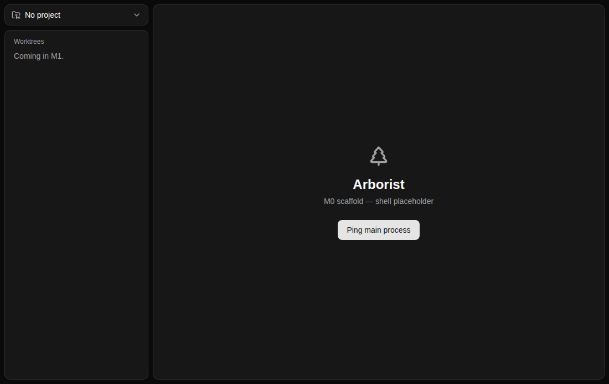
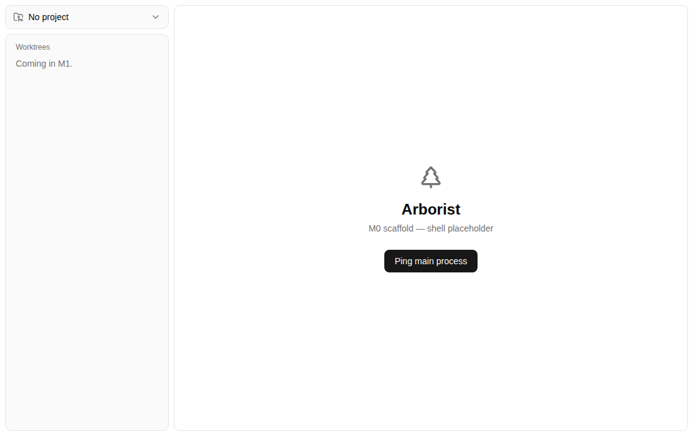
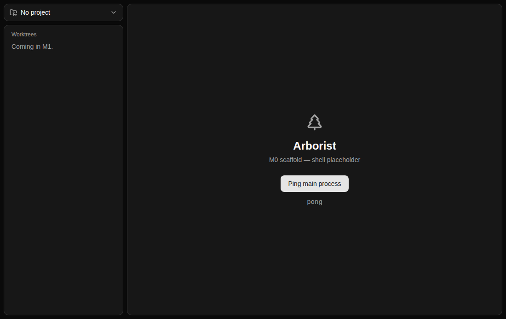

# Screenshots

Captures of the real Electron window, for attaching to pull requests so UI changes can be reviewed without launching the app.

Regenerate them with `npm run screenshot`, or `xvfb-run -a npm run screenshot` on Linux. Each image comes from a scenario in `scripts/screenshots/scenarios.ts`; add one there to capture a state other than the opening screen. `CLAUDE.md` covers the workflow, including the checks a pull request needs before it goes up.

## Shell

The two-pane shell as the app opens. This is the capture to compare against `concept.png`.

| Dark                             | Light                              |
| -------------------------------- | ---------------------------------- |
|  |  |

## Ping

One scenario capturing two points in a flow: the M0 ping button before and after a round-trip to the main process. It's the one state that demonstrates a capture exercising real IPC, which a browser capture of the renderer can't show.

|        | Dark                                          | Light                                           |
| ------ | --------------------------------------------- | ----------------------------------------------- |
| Before |  |  |
| After  |    |    |

The `before` pair is byte-identical to `shell`, because the scaffold has exactly one interactive control and so nothing distinguishes the two starting states. That stops being true as soon as a scenario does any setup of its own; until then it's duplication worth knowing about rather than worth removing, since it's also the evidence that captures reproduce exactly.

---

Relative paths like the ones above only resolve inside repository files. A pull request body is rendered outside any file's directory, so embedding one there needs an absolute `github.com/.../blob/<sha>/...?raw=true` URL. On a private repository that blob URL is the only form that renders, since `raw.githubusercontent.com` serves private content only against a token the browser doesn't send.
