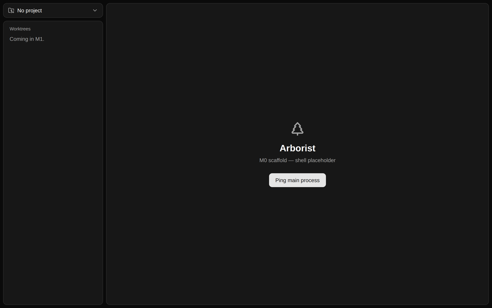

# Screenshots

Screenshots captured from the renderer running in a headless browser, for visual review in pull requests.

Markdown files in the repository can reference these images with a relative path, and GitHub resolves them when viewing the file on the web:

Note that relative paths only work inside repository files. Pull request and issue bodies are rendered outside any file's directory, so images there need an absolute URL pointing at the committed blob.
