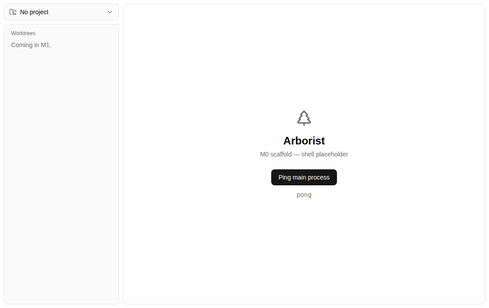

# Screenshots

Captures of the real Electron window, for attaching to pull requests so UI changes can be reviewed without launching the app.

Regenerate them with `npm run screenshot`, or `xvfb-run -a npm run screenshot` on Linux. Each image comes from a scenario in `scripts/screenshots/scenarios.ts`; add one there to capture a state other than the opening screen. See the "Previewing UI changes visually" section of `CLAUDE.md`.

## Shell

The two-pane shell as the app opens.

| Dark                             | Light                              |
| -------------------------------- | ---------------------------------- |
|  |  |

## Ping result

The M0 ping button after a round-trip to the main process, which is what a browser capture of the renderer can't show.

| Dark                                         | Light                                          |
| -------------------------------------------- | ---------------------------------------------- |
|  |  |

---

Relative paths like the ones above only resolve inside repository files. A pull request body is rendered outside any file's directory, so embedding one there needs an absolute `github.com/.../blob/<sha>/...?raw=true` URL. On a private repository that blob URL is the only form that renders, since `raw.githubusercontent.com` serves private content only against a token the browser doesn't send.
